# **MochiMind.ai**

**Serious Retention. Surprisingly Fun.**

**MochiMind.ai** is an advanced **AI-driven active learning platform** that helps students **retain more, stay focused, and truly understand what they study** through intelligent interruptions, recall challenges, and gamified reinforcement.

## 🚀 **Demo**

[Live Demo >](https://mochimind-ai.web.app/)

> **Note:** Authentication keys and database credentials are intentionally excluded from the public codebase for security reasons. Use the demo link above to explore the experience.

---

## 🎯 **Problem Statement**

Modern learning has become dangerously passive.
Students binge lectures, scroll PDFs, and rely on AI summaries — but **memory formation never happens**.

> *“Reliance on AI-summaries and passive consumption leads to a distinct cognitive decline in memory formation.”*
> — MIT Media Lab, *Accumulation of Cognitive Debt when Using an AI Assistant for Essay Writing Task*, 2025

This leads to:
**rapid forgetting, shallow understanding, distraction, and weak long-term retention.**

Traditional tools optimize for **consumption**, not **comprehension**.

MochiMind.ai flips the model.

Instead of helping you move faster, it makes sure you **earn the right to continue**.

Using AI, the platform enforces:
- active recall
- explain-back learning (Feynman technique)
- mandatory knowledge checks
- spaced repetition at the moment you’re about to forget
- distraction prevention & focus systems
- multi-modal reinforcement through the Memorization Zone

So learners don’t just finish content.

They **lock it in**.

---

## 💡 **Solution**

**MochiMind.ai** delivers a **complete AI-powered system for active learning and long-term retention**, integrating:

✔ **Lock-in interruptions** that pause your lecture video or e-book PDF until understanding is proven

✔ **Flashcards, Feynman explain-back, and quizzes** to force active recall

✔ **Head tracking AI & tab-switch detection** to eliminate passive watching

✔ **Built-in Pomodoro focus cycles** to maintain deep work sessions

✔ **AI-scheduled spaced repetition** using optimal forgetting-curve timing

✔ **Memorization Zone transformations** that turn material into notes, slides, mind maps, cheat sheets, songs, simulations, and mini-games

MochiMind doesn’t just help you study.

It ensures you **remember**.

---

## ✨ **Key Features**  

### **Lock-in Mode**  

> **Stop mindlessly scrolling PDFs or Video lectures. We pause your content at intervals. To proceed, you must clear Flashcards, explain concepts to AI (Feynman technique), and pass a Quiz. It also includes Head Tracking AI, Tab Switch Detection to prevent distractions, and a built-in Pomodoro timer.**

---

### **Spaced Repetition**  

> **Uses the proven 2-3-5-7 day spaced repetition method to send you smart Chrome notification reminders exactly when you're about to forget. It actively and reliably pings you to review past topics, follow optimal memory science, and strengthen long-term memory retention.**

---

### **Memorization Zone**

> **Not just fun, seriously powerful. Transform raw content into structured, AI-powered Notes, Presentation Slides, Mind Maps, Cheat Sheets, Simulations, or even custom Songs using interactive learning formats. It uses proven multi-modal techniques to push your brain to retain information longer.**

---

## 🛠️ **Technology Stack**  

```mermaid
graph TD
    A[User] -->|Interacts with UI| B[Frontend: HTML TailwindCSS]
    B -->|Authentication| C[Firebase Auth]
    B -->|Realtime Data| D[Firebase RTDB]
    B -->|Stores Files| E[Firebase Cloud Storage]
    B -->|Push Reminders| F[OneSignal API]
    B -->|Icons| G[Lucide Icons]
    B -->|Fonts| H[Google Fonts]
    B -->|Date & Time| K[Flatpickr]
    B -->|Render PDFs| L[PDF.js]
    B -->|Video Playback| M[YouTube Iframe API]

    I[Backend Logic: JavaScript] -->|Controls App Flow| B
    I -->|AI Engine| J[Finetuned Gemini 2.5 Flash]
    I -->|Head Tracking| N[Face++ API]
    I -->|Generates Songs| O[Suno AI API]
    I -->|Schedules Reviews| D
    I -->|Tracks Progress| D

    style A fill:#d65a50,color:#fdfaec,stroke:#d65a50,stroke-width:2px
    style B fill:#d65a50,color:#fdfaec,stroke:#d65a50,stroke-width:2px
    style C fill:#d65a50,color:#fdfaec,stroke:#d65a50,stroke-width:2px
    style D fill:#d65a50,color:#fdfaec,stroke:#d65a50,stroke-width:2px
    style E fill:#d65a50,color:#fdfaec,stroke:#d65a50,stroke-width:2px
    style F fill:#d65a50,color:#fdfaec,stroke:#d65a50,stroke-width:2px
    style G fill:#d65a50,color:#fdfaec,stroke:#d65a50,stroke-width:2px
    style H fill:#d65a50,color:#fdfaec,stroke:#d65a50,stroke-width:2px
    style I fill:#d65a50,color:#fdfaec,stroke:#d65a50,stroke-width:2px
    style J fill:#d65a50,color:#fdfaec,stroke:#d65a50,stroke-width:2px
    style K fill:#d65a50,color:#fdfaec,stroke:#d65a50,stroke-width:2px
    style L fill:#d65a50,color:#fdfaec,stroke:#d65a50,stroke-width:2px
    style M fill:#d65a50,color:#fdfaec,stroke:#d65a50,stroke-width:2px
    style N fill:#d65a50,color:#fdfaec,stroke:#d65a50,stroke-width:2px
    style O fill:#d65a50,color:#fdfaec,stroke:#d65a50,stroke-width:2px
```

- **Frontend**: HTML and TailwindCSS

- **Backend / Application Logic**: JavaScript

- **Authentication**: Firebase Auth (Google Sign-In)

- **Database**: Firebase Realtime Database

- **File Storage**: Firebase Cloud Storage

- **Push Notifications**: OneSignal API

- **Icons**: Lucide

- **Fonts**: Google Fonts (Fredoka & Nunito)

- **PDF Rendering**: PDF.js

- **Video Integration**: YouTube Iframe API

- **Date & Time Utilities**: Flatpickr

- **Head Tracking AI & Attention Monitoring**: Face++ API

- **AI Engine**: Highly finetuned Gemini 2.5 Flash

- **Song Generation**: Suno AI API

---

## 📋 **Impact & Benefits**

- **From Passive to Powerful:** Learners stop skimming and start retrieving knowledge, dramatically improving real understanding.

- **Higher Retention, Less Relearning:** Spaced repetition hits exactly before forgetting happens, reducing wasted study time.

- **Distraction-Proof Study Sessions:** Head tracking AI, lock screens, and forced checkpoints keep attention where it belongs.

- **Confidence Through Proof:** Flashcards, explain-backs, and quizzes make students *demonstrate* mastery, not assume it.

- **Multiple Memory Pathways:** Notes, slides, mind maps, songs, simulations, and games encode information in different cognitive formats.

- **Study Less. Remember More:** By strengthening encoding and recall, learners achieve better outcomes with fewer hours.

---

## 🚀 Getting Started

### Requirements:
- A modern web browser with JavaScript enabled.
- Stable internet connection for loading media and syncing data.

### Steps:
1. Open the app in your browser.
2. Log in or Sign up on the account page.
3. Start learning and lock in your knowledge with MochiMind.ai!

---

## 🤝 **Contributing**

Contributions are always welcome! Please follow these steps:

1. Fork the repository.  
2. Create a new branch (`git checkout -b feature/your-feature`).  
3. Commit your changes (`git commit -m 'Add your message'`).  
4. Push to the branch (`git push origin feature/your-feature`).  
5. Open a pull request.  

---

## 🛡️ License

This project is shared publicly for learning and inspiration purposes only.

❌ You may **NOT** copy, reuse, redistribute, or modify this code.  
✅ You may view and learn from the code.

Copyright © | All rights reserved

---

Built with ❤️ to make learning deeper, retention stronger, and focus unstoppable with AI.